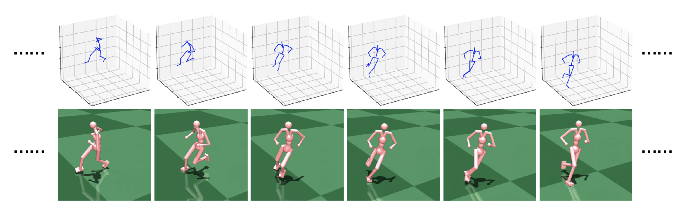

# Skeleton2Humanoid

Official implementation for ACMMM2022 paper "Skeleton2Humanoid: Animating Simulated Characters for
Physically-plausible Motion In-betweening"

[[`ACMMM2022 Paper`](https://dl.acm.org/doi/abs/10.1145/3503161.3548093)]
[[`Arxiv Paper and Supplementary Material`](https://arxiv.org/pdf/2210.04294.pdf)]
[[`video`](https://dl.acm.org/action/downloadSupplement?doi=10.1145%2F3503161.3548093&file=mm22-fp1428.mp4)]

