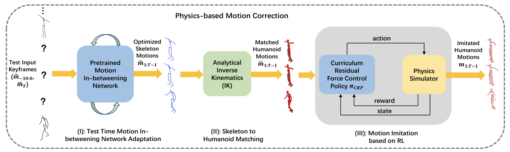
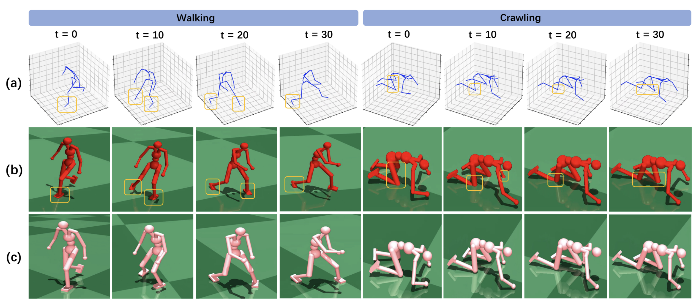
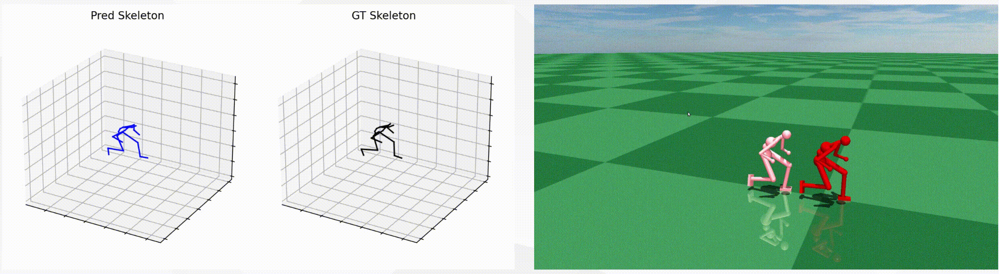

# Skeleton2Humanoid

> Official implementation for 
> 
**Skeleton2Humanoid: Animating Simulated Characters for Physically-plausible Motion In-betweening**
> 
> Yunhao Li, Zhenbo Yu, Yucheng Zhu, Bingbing Ni, Guangtao Zhai, Wei Shen
> 
> ACMMM2022 

[[`ACM Paper`](https://dl.acm.org/doi/abs/10.1145/3503161.3548093)]
[[`Arxiv Paper and Supplementary Material`](https://arxiv.org/pdf/2210.04294.pdf)]
[[`video`](https://dl.acm.org/action/downloadSupplement?doi=10.1145%2F3503161.3548093&file=mm22-fp1428.mp4)]




## To do
This repo is still under construction: 
- [x] add baseline motion inbetweening code
- [x] adding test time adaptation stage code
- [x] adding inverse kinematics code
- [x] adding RL training code

## Installation instructions

## Introduction
We propose a system “Skeleton2Humanoid” which performs physics-oriented motion correction at test time by regularizing synthesized skeleton motions in a physics simulator ([Mujoco](http://www.mujoco.org/)). Concretely, our system consists of three sequential stages: (I) test time motion synthesis network adaptation, (II) skeleton to humanoid matching and (III) motion imitation based on reinforcement learning (RL).

## Training

## Testing

## Results


<div align="center">
    <br>
</div>

<div align="center">
    <br>
</div>


<!-- <!<div align="center">
    <br>
</div> --> 


## Acknowledgments
Thanks for the following excellcent works:

[RFC](https://github.com/Khrylx/RFC), [kin-poly](https://github.com/KlabCMU/kin-poly).


<!-- ## Citation
If you find our work useful in your research, please cite our paper [skeleton2humanoid](https://arxiv.org/pdf/2210.04294.pdf):
```
@inproceedings{li2022skeleton2humanoid,
  title={Skeleton2Humanoid: Animating Simulated Characters for Physically-plausible Motion In-betweening},
  author={Li, Yunhao and Yu, Zhenbo and Zhu, Yucheng and Ni, Bingbing and Zhai, Guangtao and Shen, Wei},
  booktitle={Proceedings of the 30th ACM International Conference on Multimedia},
  pages={1493--1502},
  year={2022}
} -->

## license
To be updated
